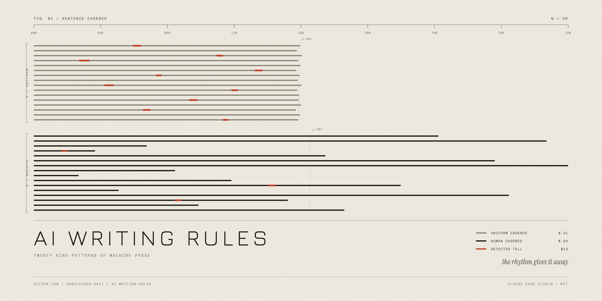

# AI writing rules



A Claude Code plugin that stops Claude writing like an AI.

It loads a compact ruleset into every session, ships a skill with 29 researched patterns, and runs a checker after every file write that flags the tells with line numbers and tells Claude to fix them.

Built from [Wikipedia's "Signs of AI writing"](https://en.wikipedia.org/wiki/Wikipedia:Signs_of_AI_writing) plus measurement work from [SlopDetector](https://slopdetector.org/blog/signs-of-ai-writing) and others, turned into rules a model can actually follow.

## Install

```
/plugin marketplace add Abdulkader-Safi/AI-Writing-Rules
/plugin install ai-writing-rules@ai-writing-rules
```

Restart Claude Code. The rules load on the next session start.

## What it does

**Loads rules at session start.** A `SessionStart` hook injects the hard rules into context. No em dashes, straight quotes, sentence case headings, no "not just X, it's Y", no three-item-list reflex, no wrap-up endings, plus the vocabulary to avoid. About 270 words, so it costs little per session.

**Checks what Claude writes.** A `PostToolUse` hook runs after every Write and Edit on `.md`, `.mdx`, `.markdown`, `.txt`, and `.rst`. It scans for 17 regex-detectable patterns plus three statistical ones, and when it finds something it reports the line numbers to Claude and asks for a fix before moving on.

Example output:

```
Writing rules: 5 issue(s) in guide.md. Fix before moving on.

  negative parallelism: delete the negation, keep the positive half
    L3: isn't just a tool, it's
  AI vocabulary: replace with the plainest word that carries the meaning
    L3: paradigm; L8: underscores
  rule of three: break the triplet: use one, two, or four
    L3: robust, seamless, and scalable
  Title Case heading: sentence case: capital on the first word only
    L1: # The Complete Guide To Modern Deployment
  uniform sentence length: burstiness 0.31, human prose is 0.6 to 1.2
```

**Gives Claude the detail on demand.** The `anti-ai-writing` skill carries the full ruleset and points at one research file per pattern, so Claude can look up a specific tell rather than loading 29 files into context.

**Rewrites on request.** `/deslop path/to/file.md` audits a file, rewrites it, and re-runs the checker to confirm it comes back clean. With no argument it works on the last thing Claude wrote.

## What gets checked

Regex rules with line numbers:

em dashes, curly quotes and the ellipsis character, negative parallelism, AI vocabulary, inflated verbs, dodged copulas, puffed significance, vague attribution, empty openers, outline endings, hedge stacks, pseudo-wisdom filler, assistant scaffolding, leaked model artifacts, Title Case headings, inline-header bullets, trailing "-ing" commentary.

Statistical rules:

- Rule of three, flagged above one polished triplet per 200 words
- Transition stacking, flagged at three or more sentences opening with a formal connector
- Burstiness, flagged when sentence-length standard deviation over mean drops under 0.4 (human prose sits at 0.6 to 1.2)

Fenced code blocks and inline code are stripped before scanning, so code samples do not trigger anything.

## Turning it off for a file

Some files quote bad examples on purpose. Add this anywhere in the file:

```
<!-- slop-check: off -->
```

Every file in `research/` carries it, for that reason.

## The research

`research/` holds one file per pattern: what it is, why models produce it, the measurable threshold where one exists, a bad example, the rewrite, and the fix. Start at [research/README.md](research/README.md).

The headline finding is that no single pattern proves anything. Every one has an innocent explanation on its own. Three or four converging in the same piece is the signal, which is why the checker reports a count rather than a verdict.

## Layout

```
.claude-plugin/
  plugin.json          plugin manifest
  marketplace.json     so the repo works as a marketplace
hooks/hooks.json       SessionStart and PostToolUse wiring
scripts/
  session-rules.sh     the ruleset injected each session
  slop-check.py        the checker
  slop-check.sh        wrapper, no-ops without python3
skills/anti-ai-writing/
  SKILL.md             full ruleset and the pattern index
commands/deslop.md     /deslop
research/              29 patterns, one per file
```

## Requirements

Python 3 for the checker. It ships with macOS and most Linux distributions. Without it the checker exits quietly and the session-start rules still work.

## Running the checker by hand

```sh
echo '{"tool_input":{"file_path":"file.md"}}' | python3 scripts/slop-check.py
```

Exit 0 means clean. Exit 2 means findings on stderr.

## Support

If this saves you some editing:

[](https://ko-fi.com/J3J11RP7T5)

## Licence

MIT. See [LICENSE](LICENSE).
